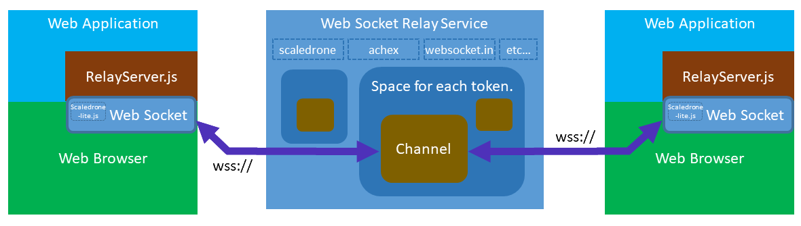

<p align="right">Language: <a href="https://chirimen.org/remote-connection/">Japanese</a>, <a href="https://translate.google.co.jp/translate?sl=ja&tl=en&u=https%3A%2F%2Fchirimen.org%2Fremote-connection%2F">English (Google Translation)</a></p>

## RelayServer.js 概要

さまざまな WebSocket リレーサービスを使用して、CHIRIMEN デバイスを含むウェブアプリをインターネットを介して簡単に通信・連携可能にするライブラリです。

[CHIRIMEN チュートリアル](http://tutorial.chirimen.org/) 受講者など初学者による利用を想定し、機能をシンプルに絞り他のライブラリや標準 API とも使い勝手を揃えることで、簡単に使えるよう設計しています。WebSocket リレーサービスはサービス毎に用語や API なども異なりますが、RelayServer.js を使えば同じ API でいつでも好みの WebSocket リレーサービスを切り替え・組み合わせて利用できます。

 Node.jsで使用することもできますので、CHIRIMEN Pi Zero版でも使用可能です。（後述）

## ためしてみる

|  `Live` Demo  |  Source  |
|:---|:---|
| [Example1](examples/example1/index.html) | [GitHub](https://github.com/chirimen-oh/remote-connection/blob/master/examples/example1/)  |
  

## ライブラリ
- [ライブラリ本体 (RelayServer.js) はこちら](js/beta/RelayServer.js) (ES Module版)
- [ラッパーモジュールはこちら](js/beta/RelayServerGlobal.js) (メインのスクリプトがESModuleでないWebAppで使用)


## 構成



上の構成図で RelayServer.js の役割を示します。

- [WebSocket](https://developer.mozilla.org/docs/Web/API/WebSockets_API)を用いたWebApps間通信を簡便に利用可能にする
- サービスごとの仕様の差異を吸収し、一つの API で利用可能にする
- CHIRIMEN 教材のためのデバイス間連携に用途を絞り、API を簡略化する
- CHIRIMEN 教材とプログラミング作法をあわせ、コールバック処理を削減し Async/Await 処理にする
- 簡易な学習・プロトタイピングを主眼とするため、セキュリティに関する特別な考慮は行っていない

-----
## 使用方法（メインのスクリプトがESModuleでないWebAppの場合）

#### ラッパーモジュールをhtmlのscript要素で読み込む
```html
<script type="module" src="https://chirimen.org/remote-connection/js/beta/RelayServerGlobal.js"></script>
````

*Note: scaledrone を使用するときには追加のライブラリ読み込みが必要です (後述)*

#### 初期化 Step1: リレーサービスインスタンスを取得する

```javascript
var relay = RelayServer("chirimentest", "chirimenSocket"); 
```

**`chirimentest` は利用したいサービス名、`chirimenSocket` はそのサービスを利用するためのトークン (chirimentest の場合は任意文字列) です。**
ここでは chirimentest(CHIRIMENのテスト用WebSocketサービス) を利用する場合を例に挙げます (他のサービスでの利用については後述)。
先の図で示したように、トークンごとに別のスペース (メッセージ中継を行うグループ) が作られ、同一トークンに接続したクライアント間で通信が可能になります。

#### 初期化 Step2: チャンネルを取得する
```javascript
var channel = await relay.subscribe("chirimenLED");
```

`chirimenLED` はチャンネル名(任意の文字列)です。

- チャンネルは図のようにトークンでつくられたスペースの中にいくつも作ることができます。
- 同じチャンネルに複数のウェブアプリから接続できます。
  - 同時接続できる数や時間当たりのメッセージ送信数はサービス毎に異なりますが、数個のデバイス、アプリからの同時接続であればどのサービスでも問題ありません。
- チャンネルに接続したWebAppsの一つがメッセージを送信すると、同じチャンネルに接続している他のWebApps全てがそれを受信します。

`subscribe()` はリレーサーバと通信して登録を行う非同期関数です (通信に時間が掛かるため)。呼び出し前に **`await` を付けるのを忘れないようにしてください**。この初期化ステップは `async` を頭に付けた非同期関数内で実行するようにしましょう。


#### 初期化Step3: メッセージ受信ハンドラを設定する
```javascript
channel.onmessage = getMessage;

function getMessage(message){
    console.log(message.data);
}
```

`onmessage` に代入した関数(ハンドラ)の第一引数にメッセージオブジェクトが送られます。メッセージオブジェクトの`data`プロパティにメッセージ本文が入っています。(上の例では`message.data`) メッセージ本文は文字列もしくは任意のオブジェクトです。（次項参照）

初期化は以上で完了です。

#### メッセージの送信
一旦初期化が完了すれば、同じサービス、トークン、チャンネルに登録したウェブアプリ間でメッセージを送受信できます。
メッセージを送信するときは次のように `send()` に送信したいメッセージを渡します。

```javascript
channel.send("Hello Remote Device");
```

メッセージとしてオブジェクトも受け付けられます。
```javascript
channel.send({temperature:24, humidity:60});
```

----
## メインのスクリプトがESModuleのwebAppで使用する場合

メインのESModuleのコードの中で、ライブラリ本体を直接インポートします。
```
import {RelayServer} from "https://chirimen.org/remote-connection/js/beta/RelayServer.js";
```

-----
## Node.jsで使用する場合

### ライブラリの場所：

https://chirimen.org/remote-connection/js/beta/RelayServer.js


### 読み込み方法

ESModuleとして読み込みます。
```
{
    "type": "module"
}
```

ライブラリの読み込みと、RelayServerインスタンス生成のためのパラメータに違いがあります。


```javascript
import nodeWebSocketLib from "websocket"; // https://www.npmjs.com/package/websocket
import { RelayServer } from "./RelayServer.js";
var relay = RelayServer("serverName", "serviceToken", nodeWebSocketLib, "OriginURL");
```

#### nodeWebSocketLib
npmでインストール (```npm install websocket```)したライブラリ```websocket```　(https://www.npmjs.com/package/websocket) を指定します。

#### OriginURL
node.jsのソフトウェアはウェブアプリと異なりコンテンツ(ウェブアプリ)のオリジンがありませんが、リレーサービスでは多くの場合オリジンが要求されます。そこでオリジンのURL(https://ドメイン名)を指定します。もしnode.jsのソフトと対向して動作するウェブアプリがあるなら、そのドメインと同じものを設定すると良いでしょう。


-----
## サービスごとの利用方法

RelayServer.js では現在、[Achex (Legacy Server)](https://achex.ca/), [Scaledrone](https://www.scaledrone.com/), [WebSocket.IN](https://www.websocket.in/) に対応しています。いずれのサービスを利用する場合でも同じ API で使えるので、好みやサービスの利用制限などに応じて簡単に切り替えられます。

サービスごとに違いがあるのは、最初の `RelayServer` インスタンスの取得部分のみです。
```javascript
var relay = RelayServer("serverName", "serviceToken");
```

**注: scaledrone では別途専用ライブラリの読み込みも必要です**

#### serverName

`RelayServer` の第一引数 `serverName` には以下のいずれかの文字列を指定してください:
- ```achex``` ： [Achex](https://achex.ca/) <!--の Legacy Server--> を利用します。
- ```piesocket``` ： [piesocket](https://www.piesocket.com/)を使います。
- ```scaledrone``` ： [scaledrone](https://www.scaledrone.com/)を使います。
- ```chirimentest``` ： CHIRIMENのテスト用簡易webSocketサービスを利用します。 
- ```wss://ホストのドメイン名``` ： CHIRIMENのテスト用簡易webSocketサービス互換のサーバを利用します。 
<!-- - ```websocket.in``` もしくは ```websocketin``` ： [WebSocket.IN](https://www.websocket.in/)を使います。-->

#### serviceToken

`RelayServer` の第二引数 `serviceToken` にはリレーサーバとの接続時に利用するトークンを指定します。ここでいうトークンはリレーサーバに接続するユーザやクライアントを認証するために使われる乱数文字列で、その指定方法やトークンに該当するものの用語 (API Key や Channel ID) はサービスごとに異なります。

### Achex <!--(Legacy Server)-->

```javascript
var relay = RelayServer("achex", "chirimenSocket"); 
```
`serverName` は　`achex`　、`serviceToken` は任意文字列が使用できます。

Achex <!--(Legacy Server)--> では接続するユーザの認証を行っておらず、トークンとしては任意の文字列を指定できます。サービスへのアカウント登録手続きやトークンの発行手続きなどが不要であり事前準備なく容易に利用できる反面、ユーザの認証を行わないため、同じチャンネル名を指定すると人は誰でも何処からでもメッセージの送受信が出来てしまいます (第三者が送受信できては困る場合には使えない)。ただしプロトコルはwss( WebSocket Secure (WSS) : TLSを用いた暗号通信)

### chirimentest , wss://ホストのドメイン名

chirimentestの使い方は上記の例の通りです。

このサービスはCHIRIMEN用に用意された、webSocketの簡易リレーサービスソフトウェア：　[CHIRIMEN WebSocketサービス](https://github.com/chirimen-oh/chirimen-web-socket-relay) を chrimen-web-socket-relay.herokuapp.com にデプロイしたものです。

同じWebSocketサービスのコードを使ってサービスを自分で用意した場合、 `serverName` に　`wss://ホストのドメイン名` と記述すると、そのサービスを使用することができます。

chirimentestもAchexと同様に認証を行っておらず、トークンとしては任意の文字列を指定できます。サービスへのアカウント登録手続きやトークンの発行手続きなどが不要であり事前準備なく容易に利用できる反面、ユーザの認証を行わないため、同じチャンネル名を指定すると人は誰でも何処からでもメッセージの送受信が出来てしまいます (第三者が送受信できては困る場合には使えない)。ただしプロトコルはwss( WebSocket Secure (WSS) : TLSを用いた暗号通信)

<!-- ### WebSocket.IN -->
### piesocket

** piesocketは無料アカウントの提供が終了してしまいました。使用するには課金が必要です**

piesocket では、RelayServer.js における `ServiceToken` のことを、「API Key」と呼んでいます。

アカウントを作成し、API Key を取得してください:

- [piesocket](https://www.piesocket.com/) で、<!--無料-->アカウントを作成します
- [piesocket のAPI Keys](https://www.piesocket.com/app/api)で、API Key を作ります。
  - `Enter Key Name` に任意の名前を指定してください。これは複数の API Key を区別できるよう付ける名前であり、コードや動作には関係ありません。指定せず空白にすることも、後で変更することも可能です。
  - `Enter Key Name` はNew Yorkを選択します。
  - `Select Platform` はWebを選択します。
  `GENERATE KEY` を押すと、指定した名前で API Key が発行され `API Keys` のリストに追加されます。
  - **`Current API Keys` リストで 〇 の中に i のアイコン(view credentials)を押すと 60 文字ぐらいのランダムな文字列の API Key が表示されます。これを RelayServer.js の `ServiceToken` に指定します。**
  - `Current API Keys` リストの 〇 の中に歯車のアイコンを押すと API Key を区別する名前や接続元として許可するドメインを指定し、別のドメインのページから接続できないように制限することで、少しセキュリティを高められます。

*Note: piesocket の仕様としては、チャンネル名には数値しか使えません。そこで RelayServer.js では `relay.subscribe()` に指定する任意の文字列をCRC16 を用いて数値に変換することで差異を吸収しています。*

### Scaledrone

Scaledrone では、RelayServer.js と用語定義が異なるので注意してください。
- RelayServer.js における `ServiceToken` は「Channel ID」になります
- RelayServer.js における「`ServiceToken` 毎に作られるスペース」のことを「CHANNEL」と呼びます
- RelayServer.js における「チャンネル」のことを、「ROOM」と呼びます

また、RelayServer.js の前に **scaledrone.com が配信している専用ライブラリも読み込む必要があります:

```html
<script src='https://cdn.scaledrone.com/scaledrone-lite.min.js'></script>
<script src="https://chirimen.org/remote-connection/js/RelayServer.js"></script>
```

アカウントとチャンネルを作成し、トークン (Channel ID) を取得してください:

- [scaledrone](https://www.scaledrone.com/)で、無料アカウントを作成します
- [scaledroneのダッシュボード](https://dashboard.scaledrone.com/channels)で、`+Create channel` ボタンを押して CHANNEL を作ります
  - `channel name` に任意の名前を指定してください。
  - Authenticationは、テスト用であれば *Never require authentication* にするのが簡単です
  - Message historyは、**Disable message history** を選ぶ。
    - RelayServer.js は履歴機能には非対応であり、執筆時点ではダッシュボードで履歴を見る機能もなく、オンにしても特に役には立ちません。セキュリティ上も履歴は残さない方がベターです
  - **Channel を選択すると Channel Overview タブに 16 文字くらいのランダムな文字列で Channel ID が表示されます。これを RelayServer.js の `ServiceToken` に指定します。** Secret Key の方ではないので注意してください。

-----
## WebIDL
RelayServer.js の [WebIDL](https://heycam.github.io/webidl/) (API 仕様を記述したもの) を以下に紹介します。

```WebIDL
enum ServiceName { "achex", "websocketin" , "websocket.in" , "scaledrone" };

[Exposed=(Window)]
interface RelayServer {
  constructor(ServiceName serviceName, USVString serviceToken);
  Promise<Channel> subscribe(optional USVString channelName);
}

interface Channel {
  readonly attribute USVString serverName;
  attribute MessageHandler onmessage;
  void send(USVString or object );
};

callback interface MessageHandler {
  void handleMessage(RSMessage message);
};

interface  RSMessage {
  readonly attribute object data;
  readonly attribute USVString origin;
  readonly attribute USVString timeStamp;
}
```

## Tests

[Test1](examples/test1/tester.html)
